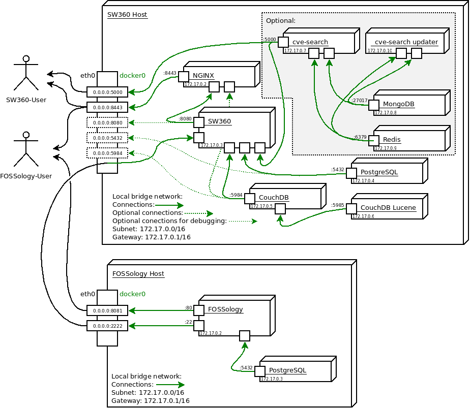

This folder contains the docker related stuff which is used for deploying SW360
in a docker context.

## Prerequisites
You need
- a current version of docker (min 1.10) [https://docs.docker.com/]
- docker-compose (min 1.8) [https://docs.docker.com/compose/install/]
- some disk space at `/var`:
  - **only sw360** needs around 1GB at `/var` and places the content of couchdb in
  the local folder `./_couchdb`
  - **with cve-search** needs around twice as much space at `/var` and places the
  content of the mongodb (currently around 4GB) in a local folder `./_mongodb`
- Internet connection at container build time to download docker images as well
  as Maven dependencies and internet connection at runtime to allow cve-search to
  crawl various external sources for security vulnerability entries.
  See section *proxy configuration* if your system resides behind a proxy.
  
## Overview
A full setup together with a dockerized FOSSology on another host could look
like this:



## Usage
The configuration of passwords, volumes and other things is done in the file
`configuration.yml`. The environment variables are not used while building. They are
only used by the entrypoint scripts of the different containers and evaluated when
the containers are actually started.

#### Changing the default configuration
The three configuration files are `configuration.env`(is read by
`./docker-compose.sh`), `proxy.env` (is read by `./docker-compose.sh` and
`docker-compose`) and `configuration.yml` (is read by `docker-compose`).

##### About `configuration.env`
By modifying the file `configuration.env` one is able to 
- enable an nginx which serves the couchdb on [https://localhost:9443/](https://localhost:9443/) and its
  gui on [https://localhost:9443/_utils/](https://localhost:9443/_utils/) by setting `HTTPS_COUCHDB=true`
  (should only be done with a password protected couchdb)
- enable development mode by setting `DEV_MODE=true`
  - adds some configuration which makes development and
    debugging easier, i.e. it exposes the database ports and also writes the
    database contents to local folders
  - suppresses some log output

  or
- enable the cve-search server by setting `CVE_SEARCH=true`
  - links cve-search to sw360 and
    configures sw360 to use the local server (**Note:** the inital sync of
    cve-search can take up to 4h)
  - serves the cve-search web application on [https://localhost:5000](https://localhost:5000).
  


Alternatively one can pass these as environmental variables, e.g. by running
```
DEV_MODE=true ./docker-compose.sh build
```

**Note:** the values set in `configuration.env` overwrite environmental variables.

##### About `proxy.env`
Here one can add proxy settings, which are passed to all docker-compose calls
and into the containers, which need to connect to the internet.

##### About `configuration.yml`
This file contains configuration, which modifies the behaviour and configuration
of container while running. It is only used while running the containers and
has no implications on the build process.

Further are passwords set in this file not written to the container while build
process nor saved in the final image.

**Note:** in an company network it might be essential to trust some SSL
certificates. This is done automatically by `./sw360/docker-entrypoint.sh` which
parses the environmental variable `$HTTPS_HOSTS` which could be set in
`configuration.yml`.
This variable has to be a list of `hosts:port` values, i.e. something like
```
      - HTTPS_HOSTS=some.bdp_host.org:443,an.ldaps.host:636
```

### Step 1: Place the dependencies (only needed initially and for updating the container)
You need to place the `.tar.gz` package of the sw360 dependencies in the folder
`./sw360/`. This can be generated by the packaging mechanisms in the
folder `../../packaging`.

Alternatively you can use the script `./prepare.sh`, which invokes the build
process for the dependencies and copies them to the appropriate location,
without the dependency to `rake` resp. Ruby.

### Step 2: Build the docker images (only needed initially and for updating the environment)
For building the currently in `configuration.env` configured part one can use the command
```
./docker-compose.sh build
```
which internally calls `docker-compose` with
- using `sudo` if necessary,
- with all needed `.yml`-files passed via the `-f` argument,
- with the correct environment

**Note:** for the innitial building phase one should enable the dev mode, since
this takes care that the `sw360baseimage` gets build before building the other
images. This base image is used for all containers, which need to access the
internet, i.e. might have to handle with proxy settings

#### Using proxy settings while building
The proxy settings, which are possibly set in the environment of the host in the
variables `http_proxy`, `https_proxy` and `no_proxy`, are passed to docker via
build arguments.

If one needs to use different proxy settings on the client one can define them
in the `proxy.env` file.
Then one has to use the wrapper `./docker-compose.sh`, which sources `proxy.env`
automatically, instead of `docker-compose` directly.

**Note:** if the host is running for example `cntlm` and the proxy settings are
`http_proxy=http://localhost:3128`, they will not work directly. You have to
make cntlm listen on the device related to docker, i.e. add
```
Listen 172.17.0.1:3128
```
to `/etc/cntlm.conf` and set `http_proxy=CNTLM_ON_GATEWAY` in the file
`proxy.env`. This will be parsed by the script `setupProxy.sh` in the
`sw360baseimage` and replaced by the ip of the gateway (i.e. the host, runing
cntlm) with the port `3128`.

### Step 3: Running the containers
The simplest way to run the containers is to use the following command
```
./docker-compose.sh up
```

#### Logging
For implementing a centralized logging we recomend the
[gliderlabs/logspout](https://github.com/gliderlabs/logspout) container, which
collects and routes the logs of all container in a very configurable way.

Further documentation can be found in the corresponding
[README.md](https://github.com/gliderlabs/logspout/blob/master/README.md).

#### Some handy docker-compose commands
Besides the up commend used in the previous description, there are more commends that
can be used with the docker-compose files listed above

Start containers detached, i.e. running in the background
```
./docker-compose.sh up -d
```

Print the combined log messages of all containers started in a docker compose network.
If you add container names (get this one with docker ps) only those logs are printed.
```
./docker-compose.sh logs -f [container name]
```

If you want to restart a specific container, e.g. you need to init a Liferay ext-plugin
you can use
```
docker restart [container name]
```
A list of all running containers can be obtained with the command
```
docker ps
```

##### Alternatively
Alternatively to step **2.** and **3.** one could use vagrant to start a
Virtualbox environment in which these steps are executed and the corresponding
ports will be forwarded to the localhost. This, by default, will not contain its
own cve-search server but contains the development setup. This can come in handy
while development.

## Building and saving images
After building and initial starting of the containers one can save all images to
the folder `./_images/` via the command
```
./docker-compose --save-images
```

Vice versa, if the images are placed under `./_images/` on can start the
containers via 
```
./docker-compose --load-images
./docker-compose up
```

## Folder structure
   
### Folders with Container
- `./sw360/` is the root folder for building the docker image conatining SW360
  - for building this needs a tar archive of the dependencies generated with the
  tools in `./../packaging`
- `./sw360couchdb/` is the root folder for building the modified couchdb
  image (contains adjustments to `local.ini`)
- `./couchdb-lucene/` contains all the files related to setting up a
  couchdb-lucene instance (indexing service for couchdb)
- `./cve-search-server/` contains the files related to the
  cve-search server container, together with an docker-compose file for
  independently running a cve-search server
- `./sw360nginx/` contains the configuration of the nginx

### Transient folders
- `./_deploy/` will be mounted as a volume to `/opt/sw360/deploy/`. This folder
receives all war files which have to be deployed. I.e. all SW360 backend service implementations
as well as all portlet implementations have to be copied into this folder in order
to deploy them properly. After deployment all files are automiatically removed from this folder
- `./_logs/` contains (persistently) the logs generated by tomcat
- `./_couchdb/` (optional) contains the persistent part of couchdb 
- `./_mongodb/` (optional) contains the persistent part of mongodb
